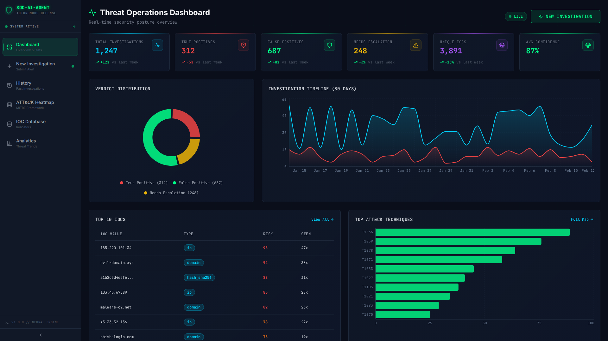
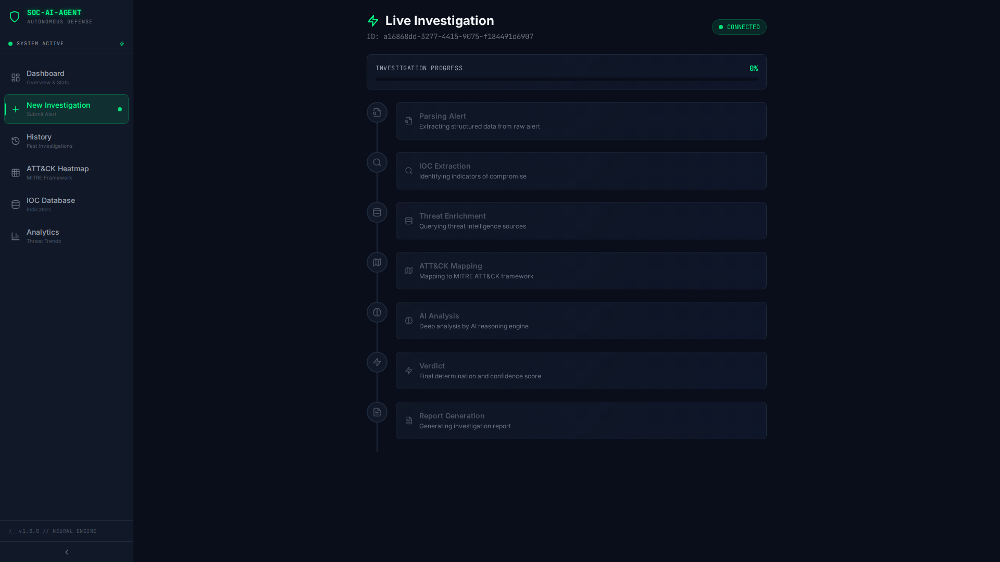
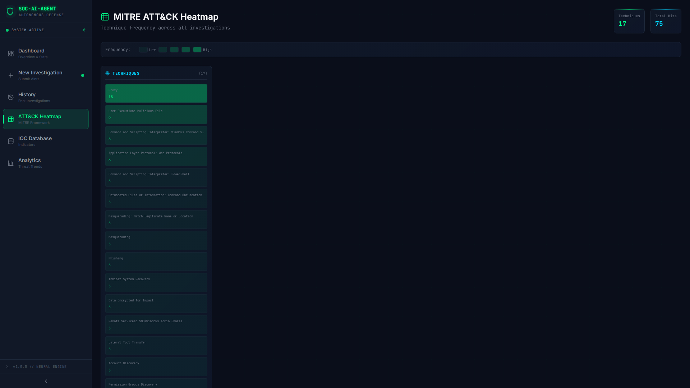
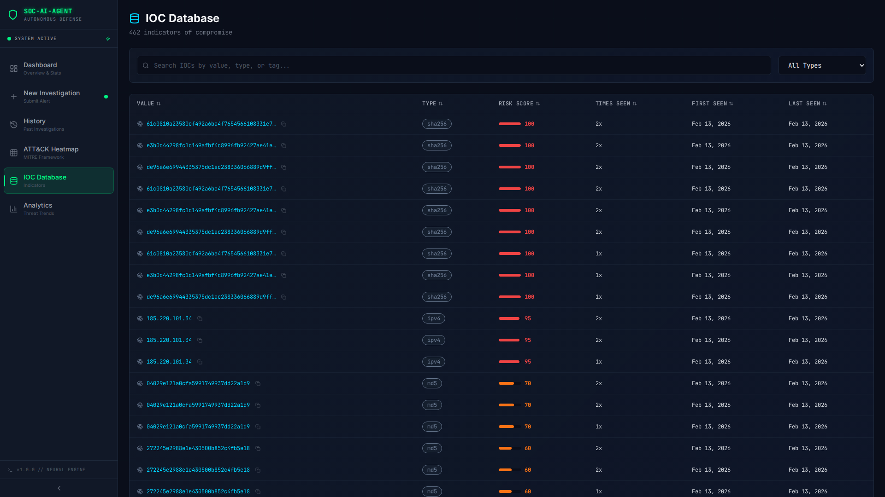
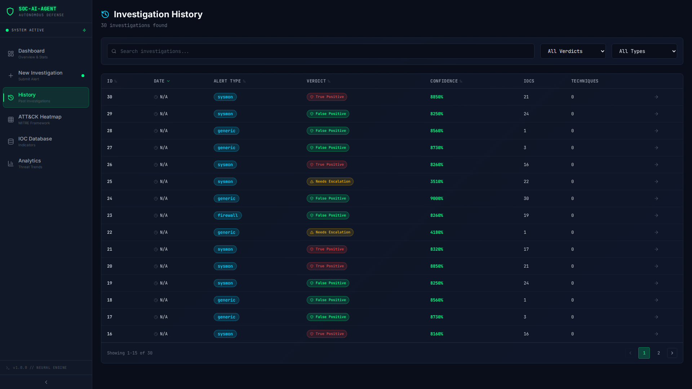
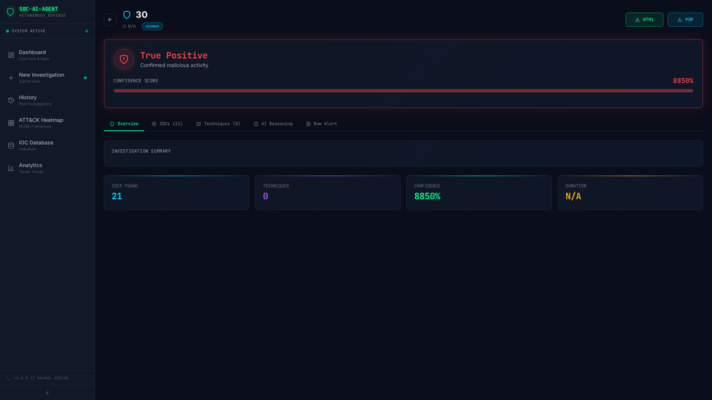
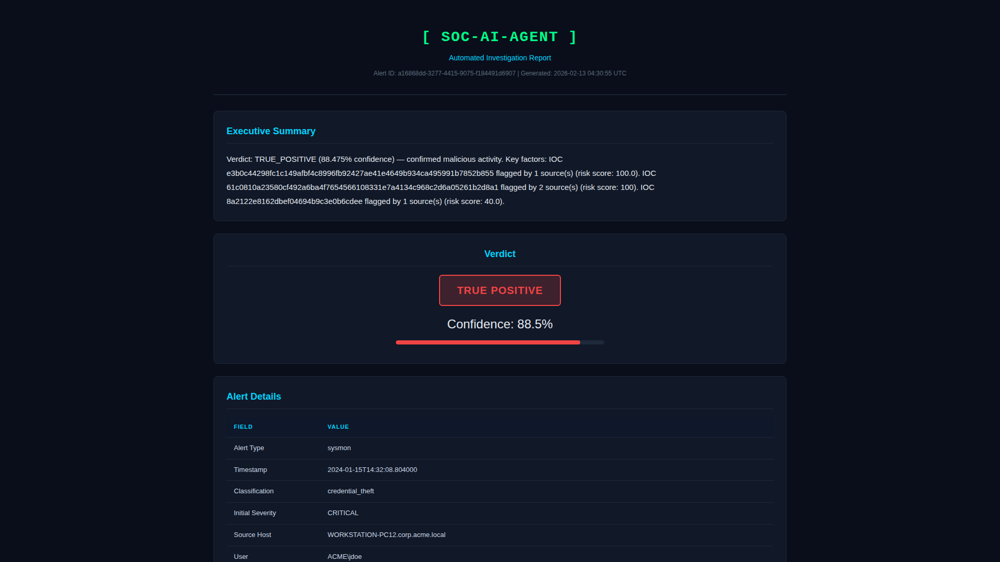
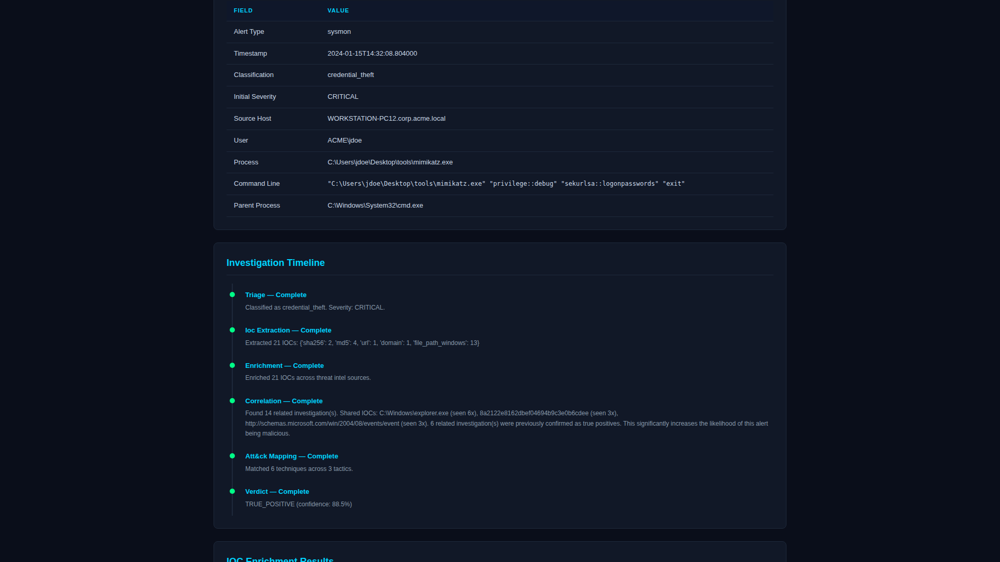
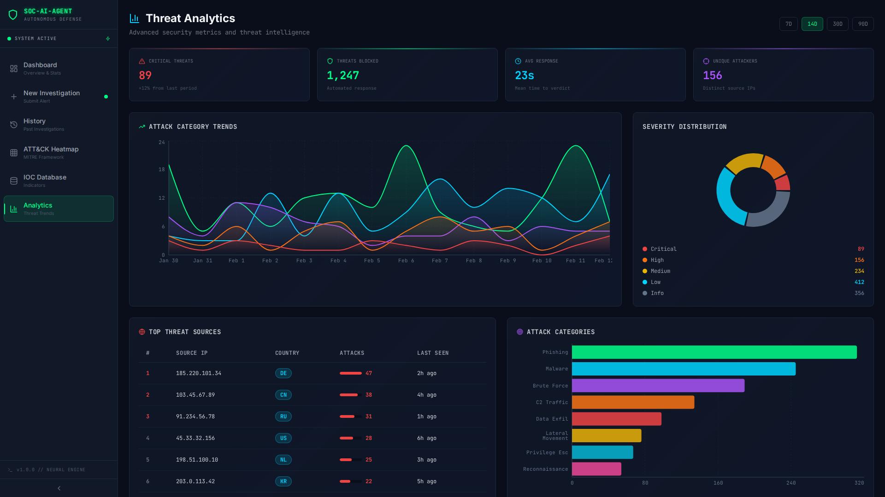
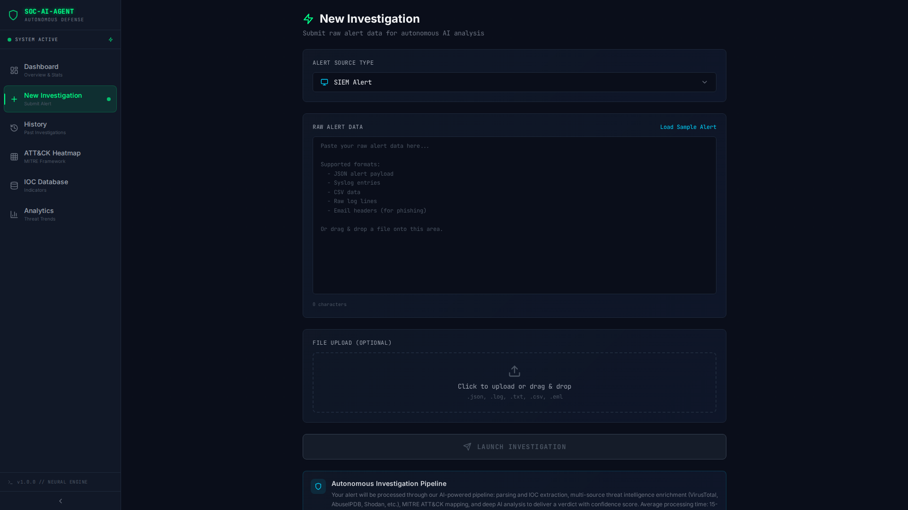

```
  ____   ___   ____       _    ___        _    ____ _____ _   _ _____
 / ___| / _ \ / ___|     / \  |_ _|      / \  / ___| ____| \ | |_   _|
 \___ \| | | | |   _____/ _ \  | |_____ / _ \| |  _|  _| |  \| | | |
  ___) | |_| | |__|_____/ ___ \ | |_____/ ___ \ |_| | |___| |\  | | |
 |____/ \___/ \____|   /_/   \_\___|  /_/   \_\____|_____|_| \_| |_|
```

# SOC-AI-Agent

**Autonomous SOC Analyst Agent** — An automated security investigation platform that triages alerts, enriches IOCs across multiple threat intelligence APIs, correlates with historical data, maps to MITRE ATT&CK, and delivers verdicts with full incident reports.

---

## Architecture

```
                           SOC-AI-Agent Pipeline
 ┌─────────────────────────────────────────────────────────────────┐
 │                                                                 │
 │  Alert Input ──► Parser ──► IOC Extractor ──► Enrichment APIs   │
 │  (text/file)    (Sysmon,    (IPs, domains,   (VirusTotal,       │
 │                  Firewall,   hashes, URLs,    AbuseIPDB,        │
 │                  Email,      emails, CVEs)    Shodan, OTX,      │
 │                  PCAP,                        URLhaus,          │
 │                  Generic)                     GreyNoise, WHOIS) │
 │                                                                 │
 │       ┌────────────────────────────────────────────┐            │
 │       │                                            ▼            │
 │       │  Correlator ◄── Enriched IOCs ──► ATT&CK Mapper        │
 │       │  (historical     (risk scores,    (behavioral rules     │
 │       │   alerts DB)      geo data,        map to techniques)   │
 │       │                   tags)                                 │
 │       │                                            │            │
 │       ▼                                            ▼            │
 │  Verdict Engine ◄─────── All Evidence ─────────────┘            │
 │  (weighted scoring,                                             │
 │   confidence calc,                                              │
 │   reasoning chain)                                              │
 │       │                                                         │
 │       ▼                                                         │
 │  Report Generator ──► HTML + PDF Reports                        │
 │       │                                                         │
 │       ▼                                                         │
 │  React Dashboard (real-time streaming via WebSocket)            │
 │                                                                 │
 └─────────────────────────────────────────────────────────────────┘
```

## Features

- **Multi-Format Alert Parsing** — Sysmon XML, Windows Event Logs, firewall logs, .eml phishing emails, PCAP output, and generic text
- **Automated IOC Extraction** — Regex-based extraction of IPs, domains, URLs, hashes (MD5/SHA1/SHA256), emails, CVEs, and file paths with defanging support
- **7 Threat Intel Sources** — VirusTotal, AbuseIPDB, Shodan, AlienVault OTX, URLhaus, GreyNoise, and WHOIS with concurrent enrichment, caching, and graceful fallbacks
- **Historical Correlation** — SQLite-backed correlation engine that links IOCs across past investigations and builds attack chains
- **MITRE ATT&CK Mapping** — 80+ technique database with 30+ behavioral mapping rules that match indicators to specific ATT&CK techniques
- **Weighted Verdict Engine** — Deterministic scoring system combining enrichment data, behavioral analysis, historical correlation, ATT&CK coverage, and temporal factors
- **Incident Report Generation** — HTML and PDF reports with executive summary, IOC tables, ATT&CK mapping, reasoning chain, and recommended response actions
- **Real-Time Dashboard** — React frontend with WebSocket streaming, live investigation viewer, ATT&CK heatmap, and IOC database
- **24-Hour Enrichment Cache** — Avoids redundant API calls for previously enriched IOCs
- **10 Realistic Sample Alerts** — Pre-built alerts covering credential theft, ransomware, phishing, C2 beaconing, lateral movement, and more

## Tech Stack

| Component | Technology |
|-----------|-----------|
| Backend | Python 3.11, FastAPI, SQLAlchemy, aiohttp |
| Frontend | React 18, Vite, Tailwind CSS, Recharts, React Router |
| Database | SQLite (async via aiosqlite) |
| Reports | Jinja2, xhtml2pdf |
| Deployment | Docker, Docker Compose |
| Real-Time | WebSockets (FastAPI native) |

## Screenshots

### Dashboard



### Live Investigation Stream


### Investigation Verdict


### MITRE ATT&CK Heatmap


### IOC Database


### Investigation History


### Investigation Detail



### Generated Incident Report



### Threat Analytics


### Alert Submission


## Prerequisites

- **Python 3.11+**
- **Node.js 18+**
- **Docker & Docker Compose** (for containerized deployment)
- API keys (all optional — the system degrades gracefully):

| API | Free Tier | Get Key |
|-----|-----------|---------|
| VirusTotal | 4 req/min, 500/day | [virustotal.com](https://www.virustotal.com/gui/join-us) |
| AbuseIPDB | 1000 checks/day | [abuseipdb.com](https://www.abuseipdb.com/account/api) |
| Shodan | Limited free | [account.shodan.io](https://account.shodan.io/register) |
| AlienVault OTX | Free unlimited | [otx.alienvault.com](https://otx.alienvault.com/api) |
| GreyNoise Community | Free | [greynoise.io](https://www.greynoise.io/viz/signup) |
| URLhaus | No key needed | — |
| WHOIS | No key needed | — |

## Quick Start (Docker)

```bash
# Clone the repository
git clone <repo-url> && cd SOC-AI-Agent

# Copy and configure environment variables
cp backend/.env.example backend/.env
# Edit backend/.env and add your API keys

# Build and start
docker-compose up --build

# Access the dashboard
# Frontend: http://localhost:3000
# Backend API: http://localhost:8000/docs
```

## Manual Setup

### Backend

```bash
cd backend

# Create virtual environment
python -m venv venv
source venv/bin/activate  # Windows: venv\Scripts\activate

# Install dependencies
pip install -r requirements.txt

# Configure environment
cp .env.example .env
# Edit .env with your API keys

# Run the server
python main.py
# or: uvicorn main:app --host 0.0.0.0 --port 8000 --reload
```

### Frontend

```bash
cd frontend

# Install dependencies
npm install

# Start development server
npm run dev
# Frontend available at http://localhost:5173
```

## API Documentation

### Endpoints

| Method | Path | Description |
|--------|------|-------------|
| `POST` | `/api/investigate` | Submit raw alert text for investigation |
| `POST` | `/api/investigate/upload` | Upload a file (.xml, .log, .eml) for investigation |
| `GET` | `/api/investigations` | List all investigations (paginated, filterable) |
| `GET` | `/api/investigations/{id}` | Get full investigation details |
| `GET` | `/api/reports/{id}/html` | Get HTML incident report |
| `GET` | `/api/reports/{id}/pdf` | Download PDF incident report |
| `GET` | `/api/iocs` | List all IOCs (searchable, paginated) |
| `GET` | `/api/iocs/{value}` | Get all intel on a specific IOC |
| `GET` | `/api/stats` | Dashboard statistics |
| `GET` | `/api/mitre/heatmap` | ATT&CK heatmap frequency data |
| `WS` | `/ws/investigate/{id}` | WebSocket stream for real-time investigation |

### Submit Investigation (POST /api/investigate)

```bash
curl -X POST http://localhost:8000/api/investigate \
  -F "content=<paste alert text here>" \
  -F "alert_type=auto"
```

Response:
```json
{
  "alert_id": "a1b2c3d4-...",
  "status": "investigating",
  "ws_url": "/ws/investigate/a1b2c3d4-..."
}
```

### WebSocket Events

Connect to `ws://localhost:8000/ws/investigate/{alert_id}` to receive real-time investigation events:

```json
{"stage": "triage", "status": "complete", "result": {...}}
{"stage": "enriching", "source": "virustotal", "ioc": "1.2.3.4", ...}
{"stage": "correlating", "status": "complete", "result": {...}}
{"stage": "mapping", "status": "complete", "result": {...}}
{"stage": "verdict", "status": "complete", "result": {"verdict": "TRUE_POSITIVE", "confidence": 87}}
{"stage": "report", "status": "complete", "result": {"report_url_html": "..."}}
{"stage": "complete", "status": "complete", "result": {...}}
```

## Sample Alerts

| File | Attack Type | Expected Verdict |
|------|------------|-----------------|
| `sysmon_mimikatz.xml` | Mimikatz credential dump | TRUE_POSITIVE |
| `sysmon_powershell_encoded.xml` | Encoded PowerShell download cradle | TRUE_POSITIVE |
| `brute_force_auth.log` | SSH brute force with success | TRUE_POSITIVE |
| `phishing_email.eml` | Phishing email with malicious link | TRUE_POSITIVE |
| `suspicious_dns.log` | DNS tunneling exfiltration | TRUE_POSITIVE |
| `ransomware_sysmon.xml` | Ransomware + shadow deletion | TRUE_POSITIVE |
| `lateral_movement.xml` | PsExec lateral movement | NEEDS_ESCALATION |
| `c2_beacon.log` | C2 HTTP beaconing pattern | TRUE_POSITIVE |
| `data_exfiltration.log` | Large off-hours data transfer | NEEDS_ESCALATION |
| `insider_threat.log` | After-hours sensitive file access | NEEDS_ESCALATION |

## Verdict Scoring System

The verdict engine uses a weighted scoring model:

| Component | Weight | Description |
|-----------|--------|-------------|
| Enrichment | 35% | Risk scores from threat intel APIs; 3+ sources flagging = high severity |
| Behavioral | 25% | Known malicious tools, suspicious commands, parent-child process anomalies |
| Correlation | 20% | IOCs seen in previous confirmed true positives boost the score |
| MITRE ATT&CK | 15% | More techniques and tactics covered = higher likelihood of real attack |
| Temporal | 5% | Off-hours and weekend activity provides slight boost |

**Thresholds:**
- Score >= 60 → `TRUE_POSITIVE`
- Score <= 20 → `FALSE_POSITIVE`
- 20 < Score < 60 → `NEEDS_ESCALATION`

## MITRE ATT&CK Mapping

The mapper uses 30+ behavioral rules that match patterns in process names, command lines, network data, and raw alert content to specific ATT&CK technique IDs. Examples:

| Pattern | Technique |
|---------|-----------|
| PowerShell + EncodedCommand | T1059.001 — PowerShell |
| lsass.exe access / Mimikatz | T1003.001 — LSASS Memory |
| vssadmin delete shadows | T1490 — Inhibit System Recovery |
| PsExec / SMB lateral | T1021.002 — SMB/Admin Shares |
| Long DNS subdomain queries | T1071.004 — DNS Protocol |
| Registry Run key modification | T1547.001 — Registry Run Keys |

The full database contains 80+ techniques across all 12 MITRE ATT&CK tactics.

## Future Roadmap

- [ ] Deep PCAP analysis with protocol dissection
- [ ] YARA rule integration for file scanning
- [ ] Slack/Teams alerting for critical verdicts
- [ ] Multi-user authentication and RBAC
- [ ] Elasticsearch/Splunk log ingestion
- [ ] SOAR playbook integration
- [ ] Machine learning anomaly detection
- [ ] Threat hunting query builder
- [ ] IOC feed import/export (STIX/TAXII)
- [ ] Custom detection rule engine

## License

MIT License. See [LICENSE](LICENSE) for details.
